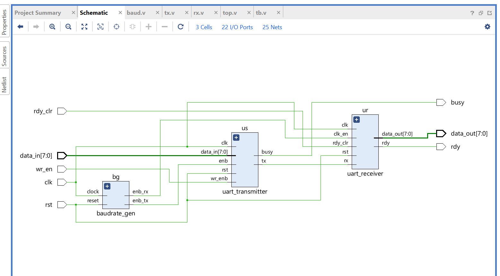
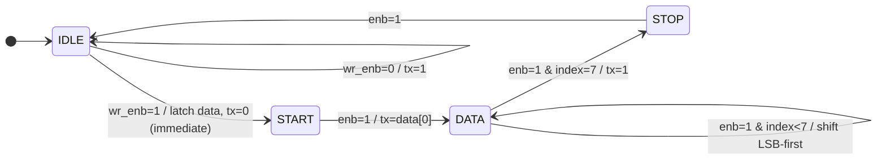
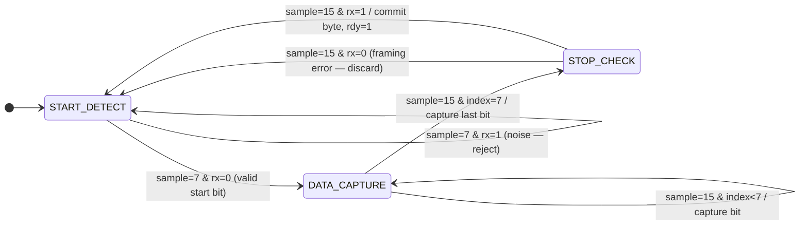
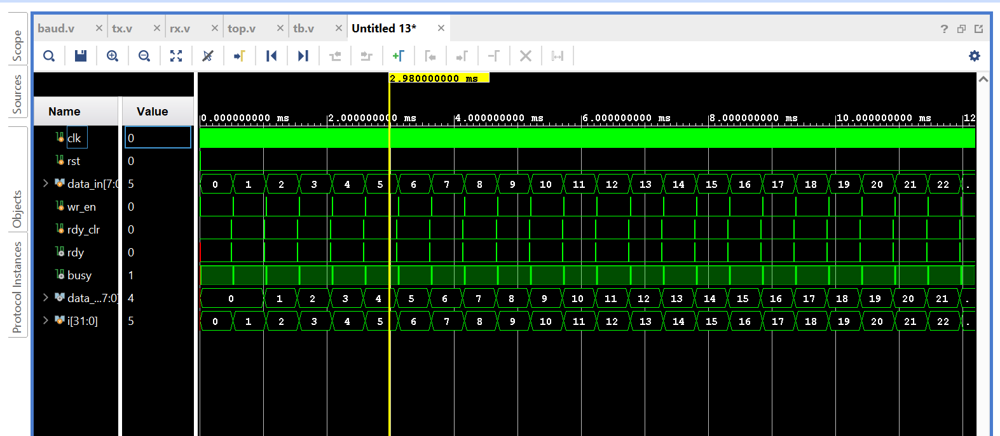
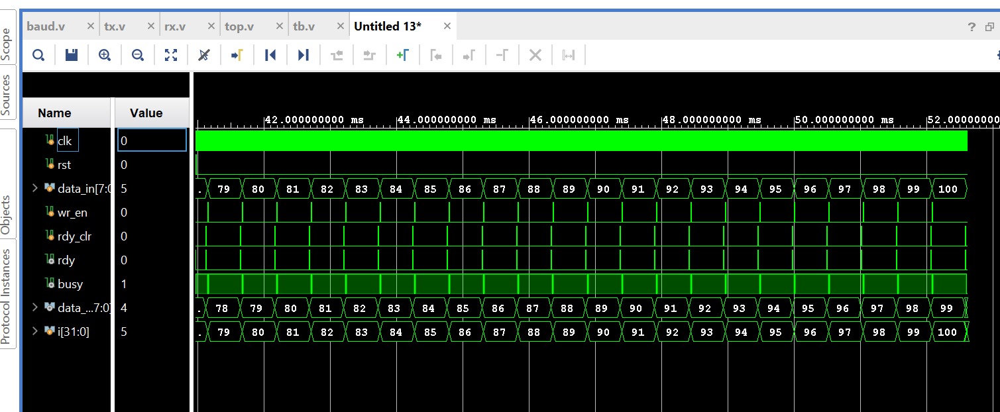
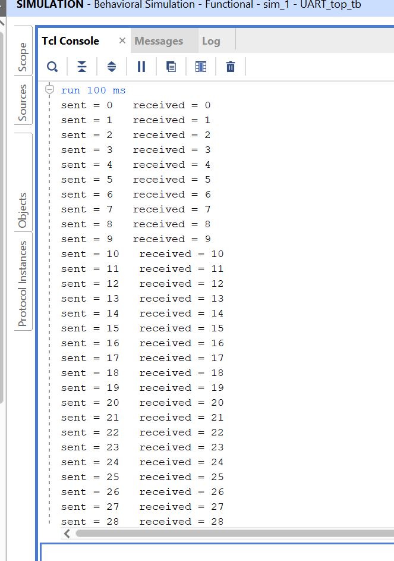
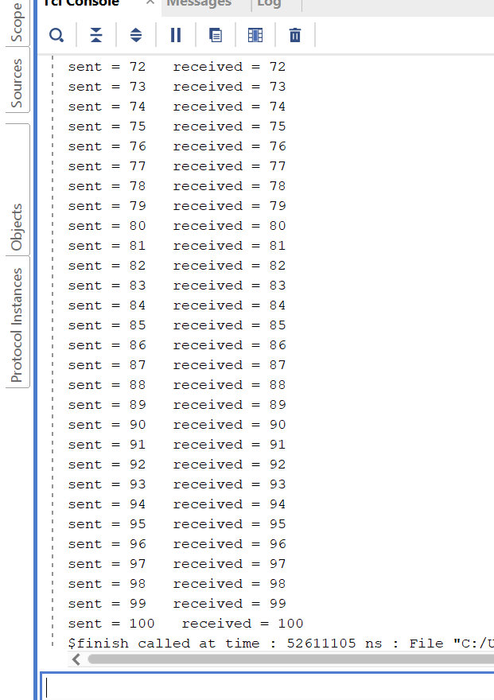

<div align="center">

# 🔌 UART Protocol — RTL Design & Verification

### Universal Asynchronous Receiver and Transmitter

[](https://github.com/ChallagollaSriPranathi/UART_Protocol)
[](https://www.xilinx.com/products/design-tools/vivado.html)

> A complete UART controller built from scratch in Verilog HDL — dual FSMs, 16× oversampling, parametric baud generation, and a self-checking 101-byte loopback testbench. Zero mismatches.

</div>

---

## 📋 Table of Contents

1. [Project Overview](#-project-overview)
2. [Architecture](#-architecture)
3. [FSM Diagrams](#-fsm-diagrams)
4. [Modules](#-modules)
5. [Repository Structure](#-repository-structure)
6. [Setup & Simulation](#-setup--simulation)
7. [Simulation Results](#-simulation-results)
8. [Author](#-author)

---

## 🔍 Project Overview

This repository implements a **UART controller** from the ground up in Verilog HDL —  from baud clock division to FSM encoding to testbench verification.

| Feature | Detail |
|---------|--------|
| 🔁 Dual FSMs | 4-state TX + 3-state RX, fully synchronous |
| 📡 16× Oversampling | Mid-bit sampling with noise/glitch rejection |
| ⚙️ Parametric Design | `CLK_FREQ` & `BAUD_RATE` tunable at instantiation |
| 🧪 Self-Checking Testbench | 101-byte sequential loopback with `$display` pass/fail |
| 🏭 Synthesizable RTL | No `#delay` logic, no latches, Xilinx FPGA-ready |

---

## 🏗️ Architecture

### System Block Diagram

```
                              ┌──────────────────────────────────────────┐
                              │               uart_top                   │
                              │                                           │
  data_in[7:0] ──────────────►│──────────────► uart_transmitter          │
  wr_en ──────────────────────►│   data        ┌────────────────────┐    │
  rst ────────────────────────►│   wr_enb      │  FSM: 4-state      │    │
  clk ────────────────────────►│               │  IDLE→START→DATA   │    │
                              │               │       →STOP         │    │
                              │               │                    tx├──┐ │
                              │               └────────────────────┘  │ │
                              │                     ▲                  │ │
                              │               enb_tx│              tx  │ │
                              │               ┌─────┴──────────────┐  │ │
                              │               │   baudrate_gen      │  │ │
                              │               │  DIV_TX = 5208      │  │ │
                              │               │  DIV_RX = 325       │  │ │
                              │               └─────┬──────────────┘  │ │
                              │               enb_rx│                  │ │
                              │                     ▼       loopback   │ │
                              │               uart_receiver ◄──────────┘ │
                              │               ┌────────────────────┐    │
                              │               │  FSM: 3-state      │    │
                              │               │  START→DATA→STOP   │    │
                              │               │  16× oversampling  │    │
                              │               └────────────────────┘    │
                              │                    │                     │
  data_out[7:0] ◄─────────────│────────────────────┘                    │
  rdy ◄───────────────────────│                                          │
  busy ◄──────────────────────│                                          │
  rdy_clr ───────────────────►│                                          │
                              └──────────────────────────────────────────┘
```



---

## Timing Parameters (50 MHz / 9600 baud)

| Parameter | Value | Formula |
|-----------|-------|---------|
| Bit period | 104,167 ns | `1 / 9600` |
| Full frame (10 bits) | 1.041 ms | `10 × 104,167 ns` |
| TX counter rollover | 5208 cycles | `50,000,000 / 9600` |
| RX oversample tick | 325 cycles | `50,000,000 / (16 × 9600)` |
| Oversample resolution | 6510 ns | Bit period / 16 |
| Start bit mid-check (tick 7) | 3797 ns into start bit | Glitch shorter than this rejected |
| Data bit sample point (tick 15) | 97,656 ns into bit period | Maximally centered |

---
## UART Frame & Timing Analysis

### Frame Structure

```
         ┌───────────────────────────────────────────────────────────────────┐
         │           One Complete UART Frame (10 bits = 1.041 ms)           │
         └───────────────────────────────────────────────────────────────────┘

Line:     ___                                                           ______
idle  ───╱   ╲___________________________________________╱───────────╱
          │    │ D0  │ D1  │ D2  │ D3  │ D4  │ D5  │ D6  │ D7  │ Stop │
          │    │ LSB │     │     │     │     │     │     │ MSB │      │
         Start                                                         Idle

         ←──── 104167 ns ────►  ← each bit = 104167 ns @ 9600 bps / 50 MHz →
```

---

## 🔄 FSM Diagrams

### Transmitter FSM — `uart_transmitter`



### Receiver FSM — `uart_receiver`



---

## 📦 Modules

### 1. `baudrate_gen` — Baud Rate Generator
**File:** `BaudRate_Generator.v`

Divides the system clock into two enable pulses:
- `enb_tx` → 1 pulse per baud period (TX advances one bit)
- `enb_rx` → 16 pulses per baud period (RX oversampling)

Counter widths are computed automatically using `$clog2()` — industry best practice that prevents truncation warnings when parameters change.

```verilog
localparam integer DIV_TX = CLK_FREQ / BAUD_RATE;        // 5208 @ 50 MHz
localparam integer DIV_RX = CLK_FREQ / (16 * BAUD_RATE); //  325 @ 50 MHz

reg [$clog2(DIV_TX)-1:0] counter_tx;  // 13-bit, self-sizing
reg [$clog2(DIV_RX)-1:0] counter_rx;  // 10-bit, self-sizing
```

**Parameters:** `CLK_FREQ` (default 100 MHz), `BAUD_RATE` (default 9600)

---

### 2. `uart_transmitter` — TX FSM
**File:** `UART_Transmitter.v`

Serialises an 8-bit byte: **start bit (low) → 8 data bits LSB-first → stop bit (high)**

| State | `tx` | Action |
|-------|------|--------|
| `IDLE` | `1` | Wait for `wr_enb` |
| `START` | `0` | Hold start bit; advance on next `enb` |
| `DATA` | `data[index]` | Shift out 8 bits on each `enb` pulse |
| `STOP` | `1` | Hold stop bit one baud period; return to IDLE |

> **Key detail:** The start bit is driven low in the *same* cycle `wr_enb` is asserted — no wasted baud period.

`busy` is purely combinational: `assign busy = (state != idle_state) || wr_enb;`

---

### 3. `uart_receiver` — RX FSM with 16× Oversampling
**File:** `UART_Receiver.v`

Detects the start bit, samples each data bit at tick 15 (true midpoint), validates the stop bit, and pulses `rdy` when a full byte is ready.

| State | Action |
|-------|--------|
| `START_DETECT` | Watches for falling edge; at tick 7 confirms rx is still low (rejects glitches) |
| `DATA_CAPTURE` | Samples `rx` at tick 15 of each baud period into `temp_register` |
| `STOP_CHECK` | At tick 15, commits byte to `data_out` if stop bit is valid; discards on framing error |

---

### 4. `uart_top` — Integration Wrapper
**File:** `Top_Module.v`

Wires all three sub-modules together. `tx_line` is internally looped back to `rx` — enabling end-to-end verification with no external hardware.

```verilog
wire tx_line;   // TX output looped → RX input
wire enb_tx;    // 1× baud enable
wire enb_rx;    // 16× baud enable
```

> **Note:** `uart_top` sets `CLK_FREQ = 50_000_000`. The testbench runs at 100 MHz, so simulation baud timing is 2× faster than real hardware — expected behaviour.

---

### 5. `UART_Testbench` — Self-Checking Testbench
**File:** `UART_Testbench.v`

Drives bytes 0–100 through the TX path and checks each received value:

```verilog
for (i = 0; i <= 100; i = i + 1) begin
    send_byte(i);           // pulse wr_en for 1 cycle
    @(posedge rdy);         // wait for receiver
    $display("sent = %0d   received = %0d", i, data_out);
    clear_ready();          // pulse rdy_clr
    @(negedge busy);        // wait for TX idle
end
```

---

## 📁 Repository Structure

```
UART_Protocol/
├── BaudRate_Generator.v      ← baudrate_gen  — parametric, $clog2 counter sizing
├── UART_Transmitter.v        ← uart_transmitter — 4-state TX FSM
├── UART_Receiver.v           ← uart_receiver   — 3-state RX FSM, 16× oversampling
├── Top_Module.v              ← uart_top — integration wrapper + TX→RX loopback
├── UART_Testbench.v          ← Self-checking TB: 101-byte sequential loopback
│
├── Schematic.png.png         ← Block diagram / schematic
├── Simulation1.png.png       ← Waveform: starting part
├── Simulation2.png.png       ← Waveform: ending part
├── Tclconsole1.png           ← TCL console: sent vs. received log (part 1)
├── TclConsole2.png           ← TCL console: sent vs. received log (part 2)
│
├── LICENSE                   ← MIT License
└── README.md
```

---

## 🚀 Setup & Simulation

### Prerequisites

| Tool | Version | Purpose |
|------|---------|---------|
| Xilinx Vivado | 2019.1+ | Synthesis, simulation, implementation |
| Git | Any | Clone the repository |


### Step 1 — Create Vivado Project

1. Open Vivado → **Create Project** → RTL Project
2. Add design sources: `BaudRate_Generator.v`, `UART_Transmitter.v`, `UART_Receiver.v`, `Top_Module.v`
3. Add simulation source: `UART_Testbench.v`
4. Target part: `xc7a35tcpg236-1` (Artix-7) or your own board
5. Set `uart_top` as design top; `UART_Testbench` as simulation top

### Step 2 — Run Behavioral Simulation

```
Flow Navigator → Simulation → Run Behavioral Simulation
```

Or via TCL console:

```tcl
launch_simulation
run all
```

**Expected output:**
```
sent = 0    received = 0
sent = 1    received = 1
...
sent = 100  received = 100
```

Supported baud rates at 50 MHz: `9600 · 19200 · 38400 · 57600 · 115200 · 230400`

---

## 🧪 Simulation Results

### Waveforms




**TCL Console — Self-Check Output**




### Summary

| Metric | Result |
|--------|--------|
| Bytes transmitted | 101 (values 0 – 100) |
| Bytes received correctly | 101 |
| Mismatches | ✅ 0 |
| Framing errors | ✅ 0 |
|Simulation time | ~105 ms (@ 50 MHz TB clock)|
---

## 👩‍💻 Author

<div align="left">

**Challagolla Sri Pranathi**

B.Tech — Electronics & Communication Engineering
Jawaharlal Nehru Technological University Hyderabad (JNTUH) 

---
## 📄 License

MIT License — Copyright © 2026 Challagolla Sri Pranathi. See [`LICENSE`](LICENSE) for full text.

---
