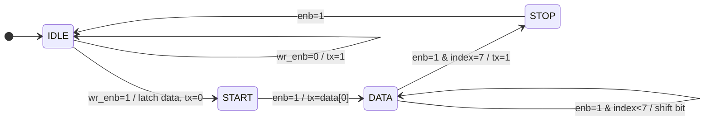
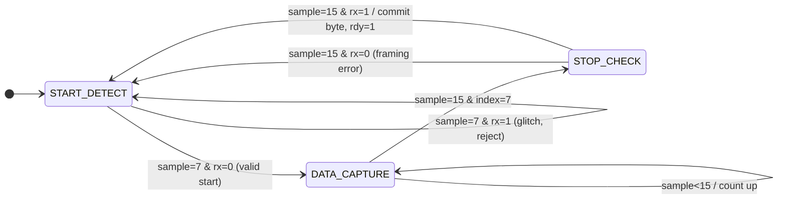

<div align="center">

# 🔌 UART Protocol — RTL Design & Verification

### Full-Stack Serial Communication Controller in Synthesizable Verilog HDL

[](https://github.com/ChallagollaSriPranathi/UART-Protocol)
[](https://www.xilinx.com/products/design-tools/vivado.html)
[](https://github.com/ChallagollaSriPranathi/UART-Protocol)
[](https://github.com/ChallagollaSriPranathi/UART-Protocol)
[](https://github.com/ChallagollaSriPranathi/UART-Protocol)
[](LICENSE)

</div>

---

## 📋 Table of Contents

1. [Project Overview](#-project-overview)
2. [Architecture](#-architecture)
3. [FSM Diagrams](#-fsm-diagrams)
4. [Modules](#-modules)
5. [Signal Reference](#-signal-reference)
6. [Repository Structure](#-repository-structure)
7. [Setup & Simulation](#-setup--simulation)
8. [Simulation Results](#-simulation-results)
9. [Future Enhancements](#-future-enhancements)
10. [Author](#-author)

---

## 🔍 Project Overview

A **complete UART controller** built from scratch in Verilog HDL — every layer hand-crafted, from baud clock division to FSM encoding to testbench verification.

> **50 MHz system clock · 115200 bps · 101-byte loopback verified · Zero mismatches**

### ✅ What's Inside

| Feature | Detail |
|---------|--------|
| 🔁 Dual FSMs | 4-state TX + 3-state RX, fully synchronous |
| 📡 16× Oversampling | Robust mid-bit sampling with glitch rejection |
| ⚙️ Parametric Design | `CLK_FREQ` & `BAUD_RATE` tunable at top level |
| 🧪 Self-Checking Testbench | 101-byte loopback with `$display` pass/fail |
| 🏭 Synthesizable RTL | No `#delay` logic, no latches, FPGA-ready |

---

## 🏗️ Architecture

```
                    ┌─────────────────────────────────────┐
                    │             uart_top                 │
                    │                                      │
  data_in[7:0] ───►│──► uart_transmitter                  │
  wr_en ──────────►│    [ IDLE → START → DATA → STOP ]   │
  clk / rst ──────►│                │ tx_line             │
                    │    baudrate_gen│◄────────────────┐   │
                    │    DIV_TX=434  │  DIV_RX=27      │   │
                    │                ▼ (loopback)      │   │
                    │    uart_receiver ────────────────┘   │
                    │    [ START_DETECT → DATA → STOP ]    │
                    │                │                     │
  data_out[7:0] ◄──│────────────────┘                     │
  rdy / busy ◄─────│                                      │
                    └─────────────────────────────────────┘
```

### ⏱️ Timing at 50 MHz / 115200 baud

| Parameter | Value |
|-----------|-------|
| Bit period | 8680 ns |
| Full frame (10 bits) | 86.81 µs |
| TX counter divider | 434 cycles |
| RX oversample divider | 27 cycles (16× per bit) |
| Glitch rejection threshold | < 3797 ns spike ignored |

---

## 🔄 FSM Diagrams

### Transmitter FSM



### Receiver FSM



---

## 📦 Modules

### 1. `baudrate_gen` — Baud Rate Generator

Generates two enable pulses from the 50 MHz system clock:
- `enb_tx` — 1 pulse per baud period (TX step)
- `enb_rx` — 16 pulses per baud period (RX oversampling)

```verilog
// Self-sizing counter widths — industry best practice
reg [$clog2(DIV_TX)-1:0] counter_tx;
reg [$clog2(DIV_RX)-1:0] counter_rx;
```

---

### 2. `uart_transmitter` — TX FSM

Serializes an 8-bit byte: **start bit (low) → 8 data bits LSB-first → stop bit (high)**

| State | `tx` | Action |
|-------|------|--------|
| `IDLE` | `1` | Wait for `wr_enb` |
| `START` | `0` | Hold start bit |
| `DATA` | `data[i]` | Shift out bits |
| `STOP` | `1` | Stop bit, return to IDLE |

> **Key detail:** Start bit is driven low in the same cycle as `wr_enb` — zero wasted baud periods.

---

### 3. `uart_receiver` — RX FSM with 16× Oversampling

Detects start bit, samples bits at tick 15 (true midpoint), validates stop bit, and outputs a `rdy` strobe.

| State | Action |
|-------|--------|
| `START_DETECT` | Wait for falling edge; mid-bit check at tick 7 rejects glitches |
| `DATA_CAPTURE` | Sample each bit at tick 15; collect into `temp_register` |
| `STOP_CHECK` | Validate `rx=1` at tick 15; commit byte or discard on framing error |

---

### 4. `uart_top` — Integration Wrapper

Wires all three modules together. `tx_line` is looped back to `rx` internally for end-to-end self-verification without external hardware.

---

### 5. `UART_top_tb` — Testbench

Drives bytes 0–100 through the TX path and checks each received value:

```verilog
for (i = 0; i <= 100; i++) begin
    send_byte(i);
    wait(rdy);
    $display("sent = %0d  received = %0d", i, data_out);
    clear_ready();
    wait(!busy);
end
```

---

## 📡 Signal Reference

| Signal | Dir | Width | Description |
|--------|-----|-------|-------------|
| `clk` | In | 1 | 50 MHz system clock |
| `rst` | In | 1 | Active-high synchronous reset |
| `data_in` | In | 8 | Byte to transmit |
| `wr_en` | In | 1 | Pulse high to start TX |
| `rdy_clr` | In | 1 | Pulse to clear `rdy` after reading |
| `busy` | Out | 1 | TX active (combinational) |
| `rdy` | Out | 1 | Valid byte in `data_out` |
| `data_out` | Out | 8 | Received byte |

---

## 📁 Repository Structure

```
UART-Protocol/
├── Baudrate_generator        ← baudrate_gen  (parametric, $clog2 sizing)
├── UART_Transmitter_TX       ← uart_transmitter (4-state FSM)
├── UART_Receiver_RX          ← uart_receiver   (16× oversampling)
├── Top_module                ← uart_top (integration + loopback)
├── UART_Testbench            ← Self-checking TB (101-byte test)
├── Simulation Output/
│   ├── output-1.png          ← Waveform: full transfer view
│   └── output-2.png          ← Waveform: zoomed timing
├── TCL console/
│   ├── output-1.png          ← Console: sent vs received log
│   └── output-2.png          ← Console: completion log
└── README.md
```

> **Note:** Source files have no `.v` extension — rename them when adding to a Vivado project.

---

## 🚀 Setup & Simulation

### Step 1 — Clone

```bash
git clone https://github.com/ChallagollaSriPranathi/UART-Protocol.git
cd UART-Protocol
```

### Step 2 — Rename Files

```bash
cp Baudrate_generator   baudrate_gen.v
cp UART_Transmitter_TX  uart_transmitter.v
cp UART_Receiver_RX     uart_receiver.v
cp Top_module           uart_top.v
cp UART_Testbench       uart_top_tb.v
```

### Step 3 — Create Vivado Project

1. Open Vivado → **Create Project** → RTL Project
2. Add design sources: `baudrate_gen.v`, `uart_transmitter.v`, `uart_receiver.v`, `uart_top.v`
3. Add simulation source: `uart_top_tb.v`
4. Target part: `xc7a35tcpg236-1` (Artix-7) or your board
5. Set `uart_top` as design top; `uart_top_tb` as sim top

### Step 4 — Run Simulation

```
Flow Navigator → Simulation → Run Behavioral Simulation
```

Or via TCL:
```tcl
launch_simulation
run all
```

### Step 5 — Change Baud Rate / Clock

```verilog
baudrate_gen #(
    .CLK_FREQ  (100_000_000),   // your board's clock in Hz
    .BAUD_RATE (9600)           // target baud rate
) bg ( ... );
```

Supported rates at 50 MHz: `9600 · 19200 · 38400 · 57600 · 115200 · 230400`

---

## 🧪 Simulation Results

| Metric | Result |
|--------|--------|
| Bytes transmitted | 101 (values 0–100) |
| Bytes received correctly | 101 |
| Mismatches | ✅ 0 |
| Framing errors | ✅ 0 |
| Simulation time | ~9 ms (@ 100 MHz TB clock) |

**Expected TCL console output:**
```
sent = 0    received = 0
sent = 1    received = 1
...
sent = 100  received = 100
```

---

## 🔮 Future Enhancements

| Enhancement | Complexity |
|-------------|-----------|
| Parity bit (even/odd/none) | 🟢 Low |
| Configurable data width (5–8 bits) | 🟢 Low |
| TX/RX FIFO buffers | 🟡 Medium |
| Hardware flow control (RTS/CTS) | 🟡 Medium |
| AXI4-Lite wrapper | 🔴 High |
| SystemVerilog UVM testbench | 🔴 High |
| FPGA hardware demo (PuTTY/Tera Term) | 🟡 Medium |

---

## 👩‍💻 Author

<div align="center">

**Challagolla Sri Pranathi**

B.Tech — Electronics & Communication Engineering
JNTUH | Class of 2026 | CGPA: 8.8 | GATE 2026 Qualified

*Aspiring RTL Design Engineer · FPGA Developer · VLSI Enthusiast*

[](https://github.com/ChallagollaSriPranathi)

</div>

### Other Projects

| Project | Technologies | Highlights |
|---------|-------------|------------|
| [16-Bit Multipliers & ALU](https://github.com/ChallagollaSriPranathi/16Bit_Multipliers-Comparison_ALU-Integration) | Verilog, Vivado, Artix-7 | Booth Radix-2/4, Wallace Tree, synthesis comparison |

---

## 📄 License

MIT License — Copyright © 2026 Challagolla Sri Pranathi

See [`LICENSE`](LICENSE) for full text.

---

<div align="center">

*Designed from scratch in Verilog HDL · Verified in Xilinx Vivado · JNTUH ECE 2026*

</div>
