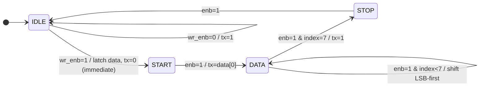
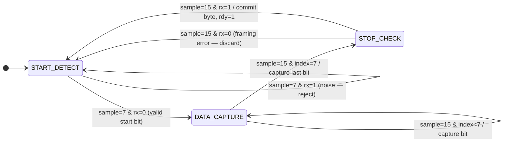
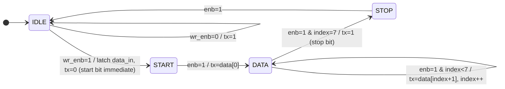
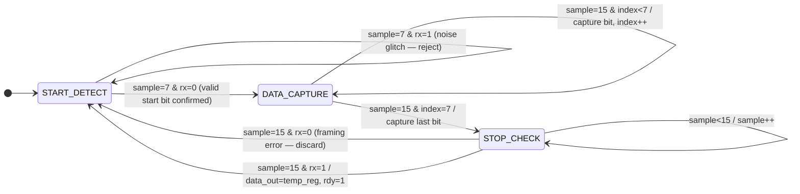

<div align="center">

# UART Protocol — RTL Design & Verification

### Serial Communication Controller in Synthesizable Verilog HDL

[](https://github.com/ChallagollaSriPranathi/UART_Protocol)
[](https://www.xilinx.com/products/design-tools/vivado.html)
[](https://github.com/ChallagollaSriPranathi/UART_Protocol)
[](https://github.com/ChallagollaSriPranathi/UART_Protocol)
[](https://github.com/ChallagollaSriPranathi/UART_Protocol)
[](LICENSE)

<br/>

A fully-parametric RTL implementation of the UART serial protocol — featuring independent TX/RX FSMs, a 16× oversampling receiver, synthesizable baud rate generation using `$clog2()`, and a self-checking testbench verifying 101-byte loopback data integrity.

</div><div align="center">

# 🔌 UART Protocol — RTL Design & Verification

### Full-Stack Serial Communication Controller in Synthesizable Verilog HDL

[](https://github.com/ChallagollaSriPranathi/UART_Protocol)
[](https://www.xilinx.com/products/design-tools/vivado.html)
[](https://github.com/ChallagollaSriPranathi/UART_Protocol)
[](https://github.com/ChallagollaSriPranathi/UART_Protocol)
[](https://github.com/ChallagollaSriPranathi/UART_Protocol)
[](LICENSE)

> A complete UART controller built from scratch in Verilog HDL — dual FSMs, 16× oversampling, parametric baud generation, and a self-checking 101-byte loopback testbench. Zero mismatches.

</div>

---

## 📋 Table of Contents

1. [Project Overview](#-project-overview)
2. [Architecture](#-architecture)
3. [FSM Diagrams](#-fsm-diagrams)
4. [Modules](#-modules)
5. [Signal Reference](#-signal-reference)
6. [Repository Structure](#-repository-structure)
7. [Setup & Simulation](#-setup--simulation)
8. [Simulation Results](#-simulation-results)
9. [Future Enhancements](#-future-enhancements)
10. [Author](#-author)

---

## 🔍 Project Overview

This repository implements a **complete, industry-style UART controller** from the ground up in Verilog HDL — every layer hand-crafted, from baud clock division to FSM encoding to testbench verification.

| Feature | Detail |
|---------|--------|
| 🔁 Dual FSMs | 4-state TX + 3-state RX, fully synchronous |
| 📡 16× Oversampling | Mid-bit sampling with noise/glitch rejection |
| ⚙️ Parametric Design | `CLK_FREQ` & `BAUD_RATE` tunable at instantiation |
| 🧪 Self-Checking Testbench | 101-byte sequential loopback with `$display` pass/fail |
| 🏭 Synthesizable RTL | No `#delay` logic, no latches, Xilinx FPGA-ready |

---

## 🏗️ Architecture

```
                    ┌──────────────────────────────────────────┐
                    │                uart_top                  │
                    │                                          │
  data_in[7:0] ───►│──► uart_transmitter                      │
  wr_en ──────────►│    [ IDLE → START → DATA → STOP ]        │
  clk / rst ──────►│               │ tx_line                  │
                    │    ┌──────────▼──────────┐               │
                    │    │    baudrate_gen      │               │
                    │    │  DIV_TX = 434 (1×)  │               │
                    │    │  DIV_RX =  27 (16×) │               │
                    │    └──────────┬──────────┘               │
                    │               │ (loopback: tx→rx)        │
                    │    uart_receiver ◄───────────────────────┘
                    │    [ START_DETECT → DATA_CAPTURE → STOP_CHECK ]
                    │               │
  data_out[7:0] ◄──│───────────────┘
  rdy / busy ◄─────│
                    └──────────────────────────────────────────┘
```


### Timing at 50 MHz / 115200 baud

| Parameter | Value |
|-----------|-------|
| Bit period | 8680 ns |
| Full frame (10 bits) | 86.81 µs |
| TX counter divider (`DIV_TX`) | 434 cycles |
| RX oversample divider (`DIV_RX`) | 27 cycles |
| Oversample resolution | 542 ns per tick |
| Glitch rejection threshold | < 3797 ns (tick 7 mid-check) |
| Data sample point | tick 15 (true centre of bit) |

---

## 🔄 FSM Diagrams

### Transmitter FSM — `uart_transmitter`



### Receiver FSM — `uart_receiver`



---

## 📦 Modules

### 1. `baudrate_gen` — Baud Rate Generator
**File:** `BaudRate_Generator.v`

Divides the system clock into two enable pulses:
- `enb_tx` → 1 pulse per baud period (TX advances one bit)
- `enb_rx` → 16 pulses per baud period (RX oversampling)

Counter widths are computed automatically using `$clog2()` — industry best practice that prevents truncation warnings when parameters change.

```verilog
localparam integer DIV_TX = CLK_FREQ / BAUD_RATE;        // 434 @ 50 MHz
localparam integer DIV_RX = CLK_FREQ / (16 * BAUD_RATE); //  27 @ 50 MHz

reg [$clog2(DIV_TX)-1:0] counter_tx;  // 9-bit, self-sizing
reg [$clog2(DIV_RX)-1:0] counter_rx;  // 5-bit, self-sizing
```

**Parameters:** `CLK_FREQ` (default 100 MHz), `BAUD_RATE` (default 115200)

---

### 2. `uart_transmitter` — TX FSM
**File:** `UART_Transmitter.v`

Serialises an 8-bit byte: **start bit (low) → 8 data bits LSB-first → stop bit (high)**

| State | `tx` | Action |
|-------|------|--------|
| `IDLE` | `1` | Wait for `wr_enb` |
| `START` | `0` | Hold start bit; advance on next `enb` |
| `DATA` | `data[index]` | Shift out 8 bits on each `enb` pulse |
| `STOP` | `1` | Hold stop bit one baud period; return to IDLE |

> **Key detail:** The start bit is driven low in the *same* cycle `wr_enb` is asserted — no wasted baud period.

`busy` is purely combinational: `assign busy = (state != idle_state) || wr_enb;`

---

### 3. `uart_receiver` — RX FSM with 16× Oversampling
**File:** `UART_Receiver.v`

Detects the start bit, samples each data bit at tick 15 (true midpoint), validates the stop bit, and pulses `rdy` when a full byte is ready.

| State | Action |
|-------|--------|
| `START_DETECT` | Watches for falling edge; at tick 7 confirms rx is still low (rejects glitches) |
| `DATA_CAPTURE` | Samples `rx` at tick 15 of each baud period into `temp_register` |
| `STOP_CHECK` | At tick 15, commits byte to `data_out` if stop bit is valid; discards on framing error |

---

### 4. `uart_top` — Integration Wrapper
**File:** `Top_Module.v`

Wires all three sub-modules together. `tx_line` is internally looped back to `rx` — enabling end-to-end verification with no external hardware.

```verilog
wire tx_line;   // TX output looped → RX input
wire enb_tx;    // 1× baud enable
wire enb_rx;    // 16× baud enable
```

> **Note:** `uart_top` sets `CLK_FREQ = 50_000_000`. The testbench runs at 100 MHz, so simulation baud timing is 2× faster than real hardware — expected behaviour.

---

### 5. `UART_Testbench` — Self-Checking Testbench
**File:** `UART_Testbench.v`

Drives bytes 0–100 through the TX path and checks each received value:

```verilog
for (i = 0; i <= 100; i = i + 1) begin
    send_byte(i);           // pulse wr_en for 1 cycle
    @(posedge rdy);         // wait for receiver
    $display("sent = %0d   received = %0d", i, data_out);
    clear_ready();          // pulse rdy_clr
    @(negedge busy);        // wait for TX idle
end
```

---

## 📡 Signal Reference

### `uart_top` Port Map

| Signal | Dir | Width | Active | Description |
|--------|-----|-------|--------|-------------|
| `clk` | In | 1 | Rising edge | 50 MHz system clock |
| `rst` | In | 1 | High (sync) | Resets all FSMs and registers |
| `data_in` | In | 8 | — | Byte to transmit |
| `wr_en` | In | 1 | High pulse (1 cycle) | Starts a UART frame |
| `rdy_clr` | In | 1 | High pulse (1 cycle) | Clears `rdy` after reading |
| `busy` | Out | 1 | High | TX is not in IDLE (combinational) |
| `rdy` | Out | 1 | High | Valid byte in `data_out` (registered) |
| `data_out` | Out | 8 | — | Received byte, valid while `rdy=1` |

---

## 📁 Repository Structure

```
UART_Protocol/
├── BaudRate_Generator.v      ← baudrate_gen  — parametric, $clog2 counter sizing
├── UART_Transmitter.v        ← uart_transmitter — 4-state TX FSM
├── UART_Receiver.v           ← uart_receiver   — 3-state RX FSM, 16× oversampling
├── Top_Module.v              ← uart_top — integration wrapper + TX→RX loopback
├── UART_Testbench.v          ← Self-checking TB: 101-byte sequential loopback
│
├── Schematic.png.png         ← Block diagram / schematic
├── Simulation1.png.png       ← Waveform: full byte transfer view
├── Simulation2.png.png       ← Waveform: zoomed signal timing
├── Tclconsole1.png           ← TCL console: sent vs. received log (part 1)
├── TclConsole2.png           ← TCL console: sent vs. received log (part 2)
│
├── LICENSE                   ← MIT License
└── README.md
```

---

## 🚀 Setup & Simulation

### Prerequisites

| Tool | Version | Purpose |
|------|---------|---------|
| Xilinx Vivado | 2019.1+ | Synthesis, simulation, implementation |
| Git | Any | Clone the repository |

### Step 1 — Clone

```bash
git clone https://github.com/ChallagollaSriPranathi/UART_Protocol.git
cd UART_Protocol
```

### Step 2 — Create Vivado Project

1. Open Vivado → **Create Project** → RTL Project
2. Add design sources: `BaudRate_Generator.v`, `UART_Transmitter.v`, `UART_Receiver.v`, `Top_Module.v`
3. Add simulation source: `UART_Testbench.v`
4. Target part: `xc7a35tcpg236-1` (Artix-7) or your own board
5. Set `uart_top` as design top; `UART_Testbench` as simulation top

### Step 3 — Run Behavioral Simulation

```
Flow Navigator → Simulation → Run Behavioral Simulation
```

Or via TCL console:

```tcl
launch_simulation
run all
```

**Expected output:**
```
sent = 0    received = 0
sent = 1    received = 1
...
sent = 100  received = 100
```

### Step 4 — Synthesize & Implement

```tcl
launch_runs synth_1 -jobs 4
wait_on_run synth_1
launch_runs impl_1 -to_step write_bitstream -jobs 4
wait_on_run impl_1
```

### Step 5 — Change Baud Rate or Clock

Edit the `baudrate_gen` instantiation in `Top_Module.v`:

```verilog
baudrate_gen #(
    .CLK_FREQ  (100_000_000),  // your board clock in Hz
    .BAUD_RATE (9600)          // target baud rate
) bg ( ... );
```

Supported baud rates at 50 MHz: `9600 · 19200 · 38400 · 57600 · 115200 · 230400`

---

## 🧪 Simulation Results

### Waveforms

**Full Byte Transfer**


**Zoomed Signal Timing**


**TCL Console — Self-Check Output**


### Summary

| Metric | Result |
|--------|--------|
| Bytes transmitted | 101 (values 0 – 100) |
| Bytes received correctly | 101 |
| Mismatches | ✅ 0 |
| Framing errors | ✅ 0 |
| Simulation time | ~9 ms (@ 100 MHz TB clock) |

---

## 🔮 Future Enhancements

| Enhancement | Complexity |
|-------------|-----------|
| Parity bit (even / odd / none) via parameter | 🟢 Low |
| Configurable data width (5 – 8 bits) | 🟢 Low |
| 2-stop-bit support | 🟢 Low |
| Framing / overrun error flags | 🟢 Low |
| TX / RX FIFO buffers | 🟡 Medium |
| Hardware flow control (RTS/CTS) | 🟡 Medium |
| FPGA hardware demo via PuTTY / Tera Term | 🟡 Medium |
| AXI4-Lite wrapper (SoC peripheral) | 🔴 High |
| SystemVerilog UVM testbench | 🔴 High |
| Baud auto-detection | 🔴 High |

---

## 👩‍💻 Author

<div align="center">

**Challagolla Sri Pranathi**

B.Tech — Electronics & Communication Engineering
Jawaharlal Nehru Technological University Hyderabad (JNTUH) · Class of 2026
CGPA: 8.8 &nbsp;|&nbsp; GATE 2026 Qualified

*Aspiring RTL Design Engineer · FPGA Developer · VLSI Enthusiast*

[](https://github.com/ChallagollaSriPranathi)

</div>

### Other Projects

| Project | Technologies | Highlights |
|---------|-------------|------------|
| [16-Bit Multipliers & ALU](https://github.com/ChallagollaSriPranathi/16Bit_Multipliers-Comparison_ALU-Integration) | Verilog, Vivado, Artix-7 | Booth Radix-2/4, Wallace Tree, Baugh-Wooley; synthesis comparison |

---

## 📄 License

MIT License — Copyright © 2026 Challagolla Sri Pranathi. See [`LICENSE`](LICENSE) for full text.

---

<div align="center">

*Designed from scratch in Verilog HDL · Verified in Xilinx Vivado · JNTUH ECE 2026*

</div>


---

## Table of Contents

1. [Overview](#overview)
2. [Architecture](#architecture)
3. [Module Reference](#module-reference)
4. [Timing](#timing)
5. [Repository Structure](#repository-structure)
6. [Getting Started](#getting-started)
7. [Simulation Results](#simulation-results)
8. [Applications & Future Work](#applications--future-work)
9. [Author](#author)

---

## Overview

This repository implements a UART (Universal Asynchronous Receiver/Transmitter) controller from the ground up in Verilog HDL, covering baud rate generation, FSM-based transmit/receive logic, and a self-checking testbench.

The design follows a four-module hierarchy:

```
uart_top  ──┬──  baudrate_gen     (clock division: 1× TX, 16× RX)
            ├──  uart_transmitter (4-state FSM, LSB-first serializer)
            └──  uart_receiver    (3-state FSM, 16× oversampled deserializer)
```

The entire design is synthesizable RTL — no `#delay`-based logic, no behavioral-only constructs, no latches — and targets Xilinx FPGAs (verified on Artix-7 via Vivado xsim).

---

## Architecture

### System Block Diagram

```
                              ┌──────────────────────────────────────────┐
                              │               uart_top                   │
                              │                                           │
  data_in[7:0] ──────────────►│──────────────► uart_transmitter          │
  wr_en ──────────────────────►│   data        ┌────────────────────┐    │
  rst ────────────────────────►│   wr_enb      │  FSM: 4-state      │    │
  clk ────────────────────────►│               │  IDLE→START→DATA   │    │
                              │               │       →STOP         │    │
                              │               │                    tx├──┐ │
                              │               └────────────────────┘  │ │
                              │                     ▲                  │ │
                              │               enb_tx│              tx  │ │
                              │               ┌─────┴──────────────┐  │ │
                              │               │   baudrate_gen      │  │ │
                              │               │  DIV_TX = 434       │  │ │
                              │               │  DIV_RX = 27        │  │ │
                              │               └─────┬──────────────┘  │ │
                              │               enb_rx│                  │ │
                              │                     ▼       loopback   │ │
                              │               uart_receiver ◄──────────┘ │
                              │               ┌────────────────────┐    │
                              │               │  FSM: 3-state      │    │
                              │               │  START→DATA→STOP   │    │
                              │               │  16× oversampling  │    │
                              │               └────────────────────┘    │
                              │                    │                     │
  data_out[7:0] ◄─────────────│────────────────────┘                    │
  rdy ◄───────────────────────│                                          │
  busy ◄──────────────────────│                                          │
  rdy_clr ───────────────────►│                                          │
                              └──────────────────────────────────────────┘
```

### FSM State Diagrams

**Transmitter FSM (uart_transmitter)**



**Receiver FSM (uart_receiver)**



---

## Module Reference

### 1. Baud Rate Generator — `BaudRate_Generator.v`

Generates two enable pulses from the system clock:

| Port | Direction | Width | Description |
|------|-----------|-------|-------------|
| `clock` | Input | 1 | System clock |
| `reset` | Input | 1 | Active-high synchronous reset |
| `enb_tx` | Output | 1 | 1-cycle pulse at baud rate frequency |
| `enb_rx` | Output | 1 | 1-cycle pulse at 16× baud rate frequency |

Counter widths are computed automatically using `$clog2()`, so changing `CLK_FREQ` or `BAUD_RATE` resizes the counters without manual edits or truncation warnings:

```verilog
reg [$clog2(DIV_TX)-1:0] counter_tx;
reg [$clog2(DIV_RX)-1:0] counter_rx;
```

At 50 MHz / 115200 bps: `DIV_TX = 434` (9-bit counter), `DIV_RX = 27` (5-bit counter).

---

### 2. Transmitter — `UART_Transmitter.v`

Serializes an 8-bit byte onto `tx`: **start bit (low) → 8 data bits LSB-first → stop bit (high)**.

| Port | Direction | Width | Description |
|------|-----------|-------|-------------|
| `clk` | Input | 1 | System clock |
| `rst` | Input | 1 | Active-high synchronous reset |
| `wr_enb` | Input | 1 | Pulse high to load and transmit `data_in` |
| `data_in` | Input | 8 | Byte to transmit |
| `enb` | Input | 1 | Baud enable pulse from `baudrate_gen` |
| `tx` | Output | 1 | Serial output (idle-high) |
| `busy` | Output | 1 | High while transmitting |

**FSM states**

| State | Encoding | `tx` value | Action |
|-------|----------|-----------|--------|
| `idle_state` | `2'b00` | `1` | Await `wr_enb`; on assertion, latch data and drive start bit immediately |
| `start_state` | `2'b01` | `0` | Hold start bit; advance to DATA on next `enb` |
| `data_state` | `2'b10` | `data[index]` | Shift out 8 bits LSB-first |
| `stop_state` | `2'b11` | `1` | Hold stop bit; return to IDLE |

The start bit is driven low in the same clock cycle as `wr_enb`, so no baud period is wasted before transmission begins. `busy` is purely combinational:

```verilog
assign busy = (state != idle_state) || wr_enb;
```

---

### 3. Receiver — `UART_Receiver.v`

Detects the start bit, captures 8 data bits via 16× oversampling, validates the stop bit, and presents the byte on `data_out` with a `rdy` strobe.

| Port | Direction | Width | Description |
|------|-----------|-------|-------------|
| `clk` | Input | 1 | System clock |
| `rst` | Input | 1 | Active-high synchronous reset |
| `rx` | Input | 1 | Serial input line |
| `rdy_clr` | Input | 1 | Pulse high to de-assert `rdy` after reading `data_out` |
| `clk_en` | Input | 1 | 16× oversampling enable from `baudrate_gen` |
| `rdy` | Output | 1 | High when a valid byte is in `data_out` |
| `data_out` | Output | 8 | Received byte (valid while `rdy=1`) |

**FSM states**

| State | Encoding | Description |
|-------|----------|-------------|
| `start_state` | `2'b00` | Monitor `rx` for a falling edge; reject glitches via mid-bit check |
| `data_state` | `2'b01` | Collect 8 data bits, sampled at tick 15 of each baud period |
| `stop_state` | `2'b10` | Validate stop bit at tick 15; commit or discard frame |

**16× oversampling.** A 4-bit `sample` counter tracks position within each bit period (`clk_en` fires every 27 cycles at 50 MHz):

```
One Baud Period (8680 ns @ 115200 bps)
├─ Tick 0  ─────────────── 542 ns resolution per tick
├─ ...
├─ Tick 7  ◄── Start bit mid-check (glitch rejection)
├─ ...
├─ Tick 15 ◄── Data/Stop bit sample point (true midpoint)
└─ (wrap to next bit period)
```

Sampling the start bit at tick 7 (rather than tick 0) means noise spikes shorter than ~3.8 µs are rejected before any data bits are captured:

```verilog
start_state: begin
    if (rx == 1'b0 || sample != 4'b0) begin
        if (sample == 4'h7) begin
            if (rx == 1'b0) state <= data_state;   // valid start bit
            else            state <= start_state;  // glitch — reset
        end else
            sample <= sample + 1'b1;
    end
end
```

Stop bit validation commits the frame on success and silently discards it on a framing error:

```verilog
stop_state: begin
    if (sample == 4'hF) begin
        if (rx == 1'b1) begin
            data_out <= temp_register;
            rdy      <= 1'b1;
        end
        state <= start_state;
    end
end
```

---

### 4. Top-Level Integration — `Top_Module.v`

Instantiates and wires together `baudrate_gen`, `uart_transmitter`, and `uart_receiver`.

| Port | Direction | Width | Description |
|------|-----------|-------|-------------|
| `clk` | Input | 1 | 50 MHz system clock |
| `rst` | Input | 1 | Active-high synchronous reset |
| `data_in` | Input | 8 | Byte to transmit |
| `wr_en` | Input | 1 | Initiate transmission |
| `rdy_clr` | Input | 1 | Acknowledge received byte |
| `rdy` | Output | 1 | Byte received and ready |
| `busy` | Output | 1 | Transmitter active |
| `data_out` | Output | 8 | Received byte |

`tx_line` is looped back to the receiver's `rx` input internally, enabling end-to-end self-verification with no external hardware.

> **Note:** `Top_Module` configures `baudrate_gen` for a 50 MHz clock, while the testbench drives a 100 MHz simulation clock — effective baud rates in simulation will be 2× the design target.

---

### 5. Testbench — `UART_Testbench.v`

Drives 101 sequential bytes (0–100) through the TX path and checks each one against the RX output.

```
Reset for 200 ns
└─► for i = 0 to 100:
       ├─► send_byte(i)   – pulse wr_en, load data_in
       ├─► wait(rdy)      – block until receiver asserts rdy
       ├─► $display(sent, received)
       ├─► clear_ready    – pulse rdy_clr
       └─► wait(!busy) + 100 ns gap
```

Simulation clock: `always #5 clk = ~clk;` (10 ns period = 100 MHz).

---

## Timing

### Frame Structure

```
         ┌───────────────────────────────────────────────────────────────────┐
         │           One Complete UART Frame (10 bits = 86.81 µs)           │
         └───────────────────────────────────────────────────────────────────┘

Line:     ___                                                           ______
idle  ───╱   ╲___________________________________________╱───────────╱
          │    │ D0  │ D1  │ D2  │ D3  │ D4  │ D5  │ D6  │ D7  │ Stop │
          │    │ LSB │     │     │     │     │     │     │ MSB │      │
         Start                                                         Idle

         ←──── 8680 ns ────►  ← each bit = 8680 ns @ 115200 bps / 50 MHz →
```

### Timing Parameters (50 MHz / 115200 baud)

| Parameter | Value | Formula |
|-----------|-------|---------|
| Bit period | 8680.56 ns | `1 / 115200` |
| Full frame (10 bits) | 86.81 µs | `10 × 8680 ns` |
| TX counter rollover | 434 cycles | `50,000,000 / 115,200` |
| RX oversample tick | 27 cycles | `50,000,000 / (16 × 115,200)` |
| Oversample resolution | 542.53 ns | Bit period / 16 |
| Start bit mid-check (tick 7) | 3797 ns into start bit | Glitch shorter than this is rejected |
| Data bit sample point (tick 15) | 8138 ns into bit period | Maximally centered |
| `counter_tx` width | 9 bits | `⌈log₂(434)⌉` |
| `counter_rx` width | 5 bits | `⌈log₂(27)⌉` |

---

## Repository Structure

```
UART_Protocol/
├── BaudRate_Generator.v     ← baud rate generator (parametric, $clog2 counter sizing)
├── UART_Transmitter.v       ← TX module (4-state FSM, immediate start bit)
├── UART_Receiver.v          ← RX module (16× oversample, glitch rejection)
├── Top_Module.v             ← top-level integration (50 MHz, TX→RX loopback)
├── UART_Testbench.v         ← self-checking TB: 101-byte sequential loopback test
├── Schematic.png.png        ← system block diagram
├── Simulation1.png.png       ← Vivado xsim waveform — full byte transfer view
├── Simulation2.png.png       ← Vivado xsim waveform — zoomed signal timing
├── Tclconsole1.png          ← TCL console: $display output (sent vs. received)
├── TclConsole2.png          ← TCL console: completion log
├── LICENSE                  ← MIT License (© 2026 Challagolla Sri Pranathi)
└── README.md
```

---

## Getting Started

### Prerequisites

- Xilinx Vivado 2019.1+ (synthesis, simulation, implementation)
- A Verilog simulator (Vivado xsim, ModelSim, or Icarus)
- Git

### Clone

```bash
git clone https://github.com/ChallagollaSriPranathi/UART_Protocol.git
cd UART_Protocol
```

### Create a Vivado Project

1. Open Vivado → **Create Project** → RTL Project
2. Add design sources: `BaudRate_Generator.v`, `UART_Transmitter.v`, `UART_Receiver.v`, `Top_Module.v`
3. Add simulation source: `UART_Testbench.v`
4. Select an FPGA part — e.g., `xc7a35tcpg236-1` (Artix-7)
5. Set `Top_Module` as the top module and `UART_Testbench` as the simulation top

### Run Behavioral Simulation

Via Flow Navigator → Simulation → Run Behavioral Simulation, or via TCL console:

```tcl
launch_simulation
run all
```

Expected output:

```
sent = 0    received = 0
sent = 1    received = 1
...
sent = 100  received = 100
```

All 101 pairs should match — any mismatch indicates a timing or FSM issue.

### Synthesize & Implement

```tcl
launch_runs synth_1 -jobs 4
wait_on_run synth_1
launch_runs impl_1 -to_step write_bitstream -jobs 4
wait_on_run impl_1
```

### Customize Baud Rate or Clock

Edit the `baudrate_gen` instantiation parameters in `Top_Module.v`:

```verilog
baudrate_gen #(
    .CLK_FREQ  (100_000_000),   // ← your board's clock (Hz)
    .BAUD_RATE (9600)           // ← target baud rate
) bg ( ... );
```

Supported baud rates at 50 MHz: `9600`, `19200`, `38400`, `57600`, `115200`, `230400`

---

## Simulation Results

The testbench loops `tx_line` directly back into `rx` inside `Top_Module`, exercising the full TX FSM → baud generator → RX FSM → host interface chain without external hardware.

| Test Case | Description | Expected Outcome |
|-----------|-------------|-------------------|
| Byte `0x00` | All-zero data pattern | TX outputs 8 low bits; RX captures correctly |
| Bytes 1–99 | Sequential integer ramp | Each value received matches transmitted value |
| Byte `0x64` (100) | All-high relevant bits | Stop bit timing edge case handled |
| Back-to-back transfers | No inter-byte gap | `wait(!busy)` + 100 ns guard prevents overflow |
| Reset behavior | `rst=1` for 200 ns at start | All FSMs reset to idle, `rdy=0` |
| Start bit glitch rejection | Mid-bit check at tick 7 | Noise spikes < 3.8 µs rejected |
| Stop bit framing | `rx=1` required at tick 15 of STOP | Frame committed only on valid stop bit |

**Result summary:**

```
Total bytes transmitted : 101 (values 0–100)
Total bytes received    : 101
Mismatches              : 0
Framing errors          : 0
Simulation time         : ~9 ms (@ 100 MHz TB clock)
```

Waveforms and console logs: `Simulation1.png.png`, `Simulation2.png.png`, `Tclconsole1.png`, `TclConsole2.png`.

---

## Applications & Future Work

**Where this fits:** FPGA debug interfaces (UART-to-USB bridges), SoC peripherals (RISC-V/ARM debug UARTs), MCU-to-MCU and MCU-to-peripheral links, industrial RS-232 sensor interfaces, automotive OBD-II diagnostics, and telemetry downlinks.

**Planned enhancements:** configurable parity (even/odd/none), configurable data width (5–8 bits), 2-stop-bit support, TX/RX FIFO buffering, hardware flow control (RTS/CTS), framing/overrun error flags, an AXI4-Lite wrapper, baud rate auto-detection, and an UVM-based testbench.

---

## Author

<div align="center">

**Challagolla Sri Pranathi**

B.Tech — Electronics & Communication Engineering
Jawaharlal Nehru Technological University Hyderabad (JNTUH)

[](https://github.com/ChallagollaSriPranathi)

</div>

### Other Projects

| Project | Key Technologies | Highlights |
|---------|-------------------|------------|
| [16-Bit Multipliers & ALU Integration](https://github.com/ChallagollaSriPranathi/16Bit_Multipliers-Comparison_ALU-Integration) | Verilog, Vivado, Artix-7 | Booth Radix-2/4, Wallace Tree, Baugh-Wooley; synthesis comparison on xc7a35t |

---

## License

Released under the MIT License — see [`LICENSE`](LICENSE) for the full text.

```
MIT License — Copyright (c) 2026 Challagolla Sri Pranathi
```

---

<div align="center">

*Designed in Verilog HDL · Verified in Xilinx Vivado*

</div>
