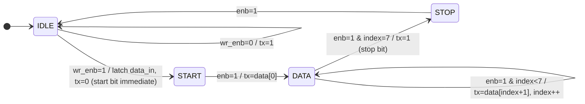
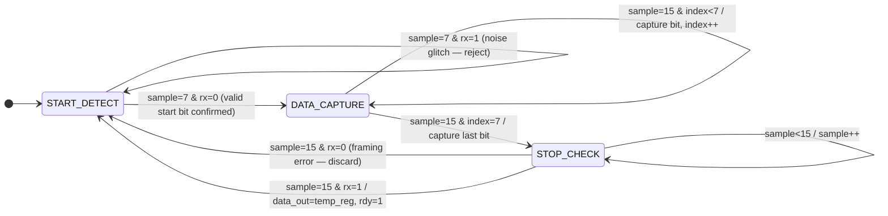

<div align="center">

# UART Protocol — RTL Design & Verification

[](https://github.com/ChallagollaSriPranathi/UART-Protocol)
[](https://www.xilinx.com/products/design-tools/vivado.html)
[](https://github.com/ChallagollaSriPranathi/UART-Protocol)
[](https://github.com/ChallagollaSriPranathi/UART-Protocol)
[](https://github.com/ChallagollaSriPranathi/UART-Protocol)
[](LICENSE)

---

## Table of Contents

1. [Project Overview](#-project-overview)
2. [Why UART? Why RTL?](#-why-uart-why-rtl)
3. [Architecture](#-architecture)
4. [Module Deep-Dive](#-module-deep-dive)
   - [Baud Rate Generator](#1-baudrate_gen--baud-rate-generator)
   - [UART Transmitter](#2-uart_transmitter--tx-finite-state-machine)
   - [UART Receiver](#3-uart_receiver--rx-finite-state-machine-with-16-oversampling)
   - [Top Module](#4-uart_top--integration-wrapper)
   - [Testbench](#5-uart_top_tb--self-checking-testbench)
5. [UART Frame & Timing](#-uart-frame--timing-analysis)
6. [Signal Interface Reference](#-signal-interface-reference)
7. [Repository Structure](#-repository-structure)
8. [Setup & Simulation](#-setup--simulation)
9. [Simulation Results](#-simulation-results)
10. [Technologies Used](#-technologies-used)
11. [Real-World Applications](#-real-world-applications)
12. [Future Enhancements](#-future-enhancements)
13. [Key Takeaways & Skills Demonstrated](#-key-takeaways--skills-demonstrated)
14. [Author](#-author)

---

## 🔍 Project Overview

This repository implements a **complete, industry-style UART (Universal Asynchronous Receiver/Transmitter) controller** from the ground up in Verilog HDL. Every layer of the design — from baud clock division to FSM state encoding to testbench verification tasks — is hand-crafted and documented.

The design is structured as a **four-module hierarchy**:

```
uart_top  ──┬──  baudrate_gen    (clock division: 1× TX, 16× RX)
            ├──  uart_transmitter (4-state FSM, LSB-first serializer)
            └──  uart_receiver    (3-state FSM, 16× oversampled deserializer)
```

Everything is **synthesizable RTL** — no `#delay`-driven logic, no behavioral-only constructs, no latches. The design targets Xilinx FPGAs and is verified through a structured Verilog testbench with `$display`-based pass/fail output.

---

## 💡 Why UART? Why RTL?

UART is the most widely deployed serial communication standard in the world. It appears in virtually every embedded SoC, FPGA peripheral bus, debug interface, and microcontroller ecosystem — from RISC-V soft-cores to automotive ECUs. Implementing it at the **register-transfer level** rather than using vendor IP means:

- You control every timing edge, every FSM transition, every bit on the wire
- The design is **vendor-independent** and portable to any FPGA or ASIC flow
- You prove mastery of the skills that matter in RTL interviews: FSM design, clock enable gating, synthesis constraints, testbench methodology

This project was built as a **portfolio-grade RTL exercise** targeting fresher roles in FPGA engineering, RTL design, and digital verification.

---

## 🏗️ Architecture

### System Block Diagram

```
                              ┌──────────────────────────────────────────┐
                              │               uart_top                   │
                              │                                           │
  data_in[7:0] ──────────────►│──────────────► uart_transmitter          │
  wr_en ──────────────────────►│   data        ┌────────────────────┐    │
  rst ────────────────────────►│   wr_enb      │  FSM: 4-state      │    │
  clk ────────────────────────►│               │  IDLE→START→DATA   │    │
                              │               │       →STOP         │    │
                              │               │                    tx├──┐ │
                              │               └────────────────────┘  │ │
                              │                     ▲                  │ │
                              │               enb_tx│              tx  │ │
                              │               ┌─────┴──────────────┐  │ │
                              │               │   baudrate_gen      │  │ │
                              │               │  DIV_TX = 434       │  │ │
                              │               │  DIV_RX = 27        │  │ │
                              │               └─────┬──────────────┘  │ │
                              │               enb_rx│                  │ │
                              │                     ▼       loopback   │ │
                              │               uart_receiver ◄──────────┘ │
                              │               ┌────────────────────┐    │
                              │               │  FSM: 3-state      │    │
                              │               │  START→DATA→STOP   │    │
                              │               │  16× oversampling  │    │
                              │               └────────────────────┘    │
                              │                    │                     │
  data_out[7:0] ◄─────────────│────────────────────┘                    │
  rdy ◄───────────────────────│                                          │
  busy ◄──────────────────────│                                          │
  rdy_clr ───────────────────►│                                          │
                              └──────────────────────────────────────────┘
```

### FSM State Diagrams

**Transmitter FSM (uart_transmitter)**



**Receiver FSM (uart_receiver)**



---

## 📦 Module Deep-Dive

---

### 1. `baudrate_gen` — Baud Rate Generator

**File:** `Baudrate_generator`

#### Purpose
Generates two time-divided enable pulses from the system clock:
- `enb_tx` — fires once per baud period (for the TX FSM to advance one bit)
- `enb_rx` — fires 16× per baud period (for the RX FSM's oversampling counter)

#### Port Table

| Port | Direction | Width | Description |
|------|-----------|-------|-------------|
| `clock` | Input | 1 | System clock |
| `reset` | Input | 1 | Active-high synchronous reset |
| `enb_tx` | Output | 1 | 1-cycle pulse at baud rate frequency |
| `enb_rx` | Output | 1 | 1-cycle pulse at 16× baud rate frequency |

#### Parameters

| Parameter | Default | Description |
|-----------|---------|-------------|
| `CLK_FREQ` | 100,000,000 | System clock frequency in Hz |
| `BAUD_RATE` | 115,200 | Desired baud rate in bps |

#### Timing Math (as instantiated in `uart_top`)

```
CLK_FREQ  = 50,000,000 Hz  (50 MHz, set in Top_module)
BAUD_RATE = 115,200 bps

DIV_TX = 50,000,000 ÷ 115,200         = 434  (counter_tx wraps every 434 cycles)
DIV_RX = 50,000,000 ÷ (16 × 115,200)  =  27  (counter_rx wraps every 27 cycles)

counter_tx width = ⌈log₂(434)⌉ = 9 bits   ← computed by $clog2(DIV_TX)
counter_rx width = ⌈log₂(27)⌉  = 5 bits   ← computed by $clog2(DIV_RX)
```

#### Key Design Decision — `$clog2()` Sizing
Rather than hardcoding counter widths (`reg [8:0] counter_tx`), this design uses:
```verilog
reg [$clog2(DIV_TX)-1:0] counter_tx;
reg [$clog2(DIV_RX)-1:0] counter_rx;
```
This is a synthesis-safe, **self-adjusting counter width** — if you change `CLK_FREQ` or `BAUD_RATE`, the counter automatically resizes without producing truncation warnings. This is an industry best practice rarely seen in student projects.

---

### 2. `uart_transmitter` — TX Finite State Machine

**File:** `UART_Transmitter_TX`

#### Purpose
Accepts an 8-bit parallel byte on `data_in` and serializes it onto the `tx` line following the UART frame protocol: **start bit (low) → 8 data bits LSB-first → stop bit (high)**.

#### Port Table

| Port | Direction | Width | Description |
|------|-----------|-------|-------------|
| `clk` | Input | 1 | System clock |
| `rst` | Input | 1 | Active-high synchronous reset |
| `wr_enb` | Input | 1 | Write enable — pulse high to load and transmit `data_in` |
| `data_in` | Input | 8 | Byte to transmit |
| `enb` | Input | 1 | Baud enable pulse from `baudrate_gen` |
| `tx` | Output | 1 | Serial output line (idle-high per UART convention) |
| `busy` | Output | 1 | High whenever transmitter is active (combinational) |

#### FSM State Encoding

| State | Encoding | `tx` value | Action |
|-------|----------|-----------|--------|
| `idle_state` | `2'b00` | `1` | Await `wr_enb`; latch data and drive start bit immediately on assertion |
| `start_state` | `2'b01` | `0` | Hold start bit; advance to DATA on next `enb` |
| `data_state` | `2'b10` | `data[index]` | Shift out 8 bits LSB-first on each `enb` pulse |
| `stop_state` | `2'b11` | `1` | Hold stop bit for one baud period; return to IDLE |

#### Notable Design Detail — Immediate Start Bit
The start bit is driven low *in the same clock cycle* as `wr_enb` is asserted, **before** the next `enb_tx` pulse. This means the transmitter does not waste a baud period — the serial line goes low the instant the host requests a transfer.

```verilog
idle_state: begin
    tx <= 1'b1;
    if(wr_enb) begin
        state <= start_state;
        data  <= data_in;
        tx    <= 1'b0;     // ← start bit immediate, same cycle as wr_enb
    end
end
```

#### `busy` Signal
```verilog
assign busy = (state != idle_state) || wr_enb;
```
A purely combinational output — no extra register needed. Asserted the moment `wr_enb` rises and de-asserted only when the FSM has fully returned to IDLE.

---

### 3. `uart_receiver` — RX Finite State Machine with 16× Oversampling

**File:** `UART_Receiver_RX`

#### Purpose
Detects an incoming UART start bit, samples each of the 8 data bits at their midpoints using 16× oversampling, validates the stop bit, and presents a complete byte on `data_out` with a `rdy` strobe.

#### Port Table

| Port | Direction | Width | Description |
|------|-----------|-------|-------------|
| `clk` | Input | 1 | System clock |
| `rst` | Input | 1 | Active-high synchronous reset |
| `rx` | Input | 1 | Serial input line |
| `rdy_clr` | Input | 1 | Pulse high to de-assert `rdy` after reading `data_out` |
| `clk_en` | Input | 1 | 16× oversampling enable from `baudrate_gen` |
| `rdy` | Output | 1 | Asserted when a complete, valid byte is in `data_out` |
| `data_out` | Output | 8 | Received byte (valid while `rdy=1`) |

#### FSM State Encoding

| State | Encoding | Description |
|-------|----------|-------------|
| `start_state` | `2'b00` | Monitor `rx` for falling edge; reject glitches via mid-bit check |
| `data_state` | `2'b01` | Collect 8 data bits, sampled at tick 15 of each baud period |
| `stop_state` | `2'b10` | Validate stop bit at tick 15; commit or discard frame |

#### 16× Oversampling Explained

The receiver's `clk_en` fires 16 times per baud period (`DIV_RX = 27` cycles at 50 MHz). A 4-bit `sample` counter tracks position within each bit period.

```
One Baud Period (8680 ns @ 115200 bps)
├─ Tick 0  ─────────────── 542 ns resolution per tick
├─ Tick 1
├─ ...
├─ Tick 7  ◄── Start bit mid-check: is rx still 0? (glitch rejection)
├─ ...
├─ Tick 15 ◄── Data/Stop bit sample point (true midpoint)
└─ (wrap to next bit period)
```

**Start Bit Noise Rejection:**
```verilog
start_state: begin
    if(rx == 1'b0 || sample != 4'b0) begin
        if(sample == 4'h7) begin          // Check at mid-start-bit
            if(rx == 1'b0)               // Still low = valid start
                state <= data_state;
            else
                state <= start_state;    // Glitch — reset, don't advance
        end else
            sample <= sample + 1'b1;
    end
end
```
This is the key difference between a robust receiver and a fragile one. Sampling at tick 7 of the start bit (rather than tick 0) means a noise spike of less than 3.8 µs wide is **silently rejected** before any data bits are touched.

**Data Capture:**
```verilog
data_state: begin
    if(sample == 4'hF) begin            // Tick 15 = center of data bit
        temp_register[index] <= rx;
        if(index == 3'h7)
            state <= stop_state;
        else
            index <= index + 1'b1;
    end else
        sample <= sample + 1'b1;
end
```

**Stop Bit & Frame Commit:**
```verilog
stop_state: begin
    if(sample == 4'hF) begin
        if(rx == 1'b1) begin            // Valid stop bit
            data_out <= temp_register;
            rdy      <= 1'b1;
        end
        state  <= start_state;          // Framing error: silently discard
    end
end
```

---

### 4. `uart_top` — Integration Wrapper

**File:** `Top_module`

#### Purpose
Instantiates all three sub-modules and wires them together. Presents a clean, minimal interface to the outside world (host logic, testbench, or other IP).

#### Port Table

| Port | Direction | Width | Description |
|------|-----------|-------|-------------|
| `clk` | Input | 1 | 50 MHz system clock |
| `rst` | Input | 1 | Active-high synchronous reset |
| `data_in` | Input | 8 | Byte to transmit |
| `wr_en` | Input | 1 | Initiate transmission |
| `rdy_clr` | Input | 1 | Acknowledge received byte |
| `rdy` | Output | 1 | Byte received and ready |
| `busy` | Output | 1 | Transmitter active |
| `data_out` | Output | 8 | Received byte |

#### Internal Wiring
```verilog
wire tx_clk_en;    // TX baud enable  (1× baud rate)
wire rx_clk_en;    // RX baud enable  (16× baud rate)
wire tx_line;      // TX serial output, looped back to RX serial input
```
The loopback (`tx_line` → `rx` of receiver) enables end-to-end self-verification without any external hardware.

#### Clock Parameter Note
`uart_top` instantiates `baudrate_gen` with `.CLK_FREQ(50_000_000)`. This targets a **50 MHz** system clock. The testbench drives a **100 MHz** clock — be aware of this mismatch when analyzing simulation timing; baud rates in simulation will be 2× the intended rate.

---

### 5. `UART_top_tb` — Self-Checking Testbench

**File:** `UART_Testbench`

#### Purpose
Full end-to-end functional verification of `uart_top`. Drives 101 sequential bytes (0–100) through the TX path and verifies each one arrives correctly at the RX output.

#### Testbench Architecture

```
Initial Block
     │
     ├─► Reset for 200 ns
     │
     └─► for i = 0 to 100:
              │
              ├─► send_byte(i)         task: pulse wr_en, load data_in
              │
              ├─► wait(rdy)            block until receiver asserts rdy
              │
              ├─► $display(sent, received)   self-checking print
              │
              ├─► clear_ready          task: pulse rdy_clr
              │
              └─► wait(!busy) + #100 ns separation gap
```

#### Testbench Tasks

```verilog
task send_byte(input [7:0] din);
begin
    @(negedge clk);
    data_in = din;
    wr_en   = 1'b1;
    @(negedge clk);
    wr_en   = 1'b0;        // 1-cycle wr_en pulse, aligned to negedge
end
endtask

task clear_ready;
begin
    @(negedge clk);
    rdy_clr = 1'b1;
    @(negedge clk);
    rdy_clr = 1'b0;        // 1-cycle rdy_clr pulse
end
endtask
```

#### Simulation Clock
```verilog
always #5 clk = ~clk;    // 10 ns period = 100 MHz simulation clock
```

---

## ⏱️ UART Frame & Timing Analysis

### Frame Structure

```
         ┌───────────────────────────────────────────────────────────────────┐
         │           One Complete UART Frame (10 bits = 86.81 µs)           │
         └───────────────────────────────────────────────────────────────────┘

Line:     ___                                                           ______
idle  ───╱   ╲___________________________________________╱───────────╱
          │    │ D0  │ D1  │ D2  │ D3  │ D4  │ D5  │ D6  │ D7  │ Stop │
          │    │ LSB │     │     │     │     │     │     │ MSB │      │
         Start                                                         Idle

         ←──── 8680 ns ────►  ← each bit = 8680 ns @ 115200 bps / 50 MHz →
```

### Timing Parameters (50 MHz / 115200 baud)

| Parameter | Value | Formula |
|-----------|-------|---------|
| Bit period | **8680.56 ns** | `1 / 115200` |
| Full frame (10 bits) | **86.81 µs** | `10 × 8680 ns` |
| TX counter rollover | **434 cycles** | `50,000,000 / 115,200` |
| RX oversample tick | **27 cycles** | `50,000,000 / (16 × 115,200)` |
| Oversample resolution | **542.53 ns** | Bit period / 16 |
| Start bit mid-check (tick 7) | **3797 ns** into start bit | Glitch < this = rejected |
| Data bit sample point (tick 15) | **8138 ns** into bit period | Maximally centered |
| `counter_tx` register width | **9 bits** | `⌈log₂(434)⌉` |
| `counter_rx` register width | **5 bits** | `⌈log₂(27)⌉` |

---

## 📡 Signal Interface Reference

### `uart_top` — Complete Pin Description

| Signal | Dir | Width | Active | Timing | Description |
|--------|-----|-------|--------|--------|-------------|
| `clk` | I | 1 | Rising edge | — | System clock (50 MHz) |
| `rst` | I | 1 | High | Synchronous | Reset all FSMs and registers |
| `data_in` | I | 8 | — | Setup before `wr_en` | Parallel byte to transmit |
| `wr_en` | I | 1 | High pulse | 1 clock cycle | Initiates UART frame transmission |
| `rdy_clr` | I | 1 | High pulse | 1 clock cycle | De-asserts `rdy` after reading `data_out` |
| `busy` | O | 1 | High | Combinational | TX FSM is not in IDLE state |
| `rdy` | O | 1 | High | Registered | Valid byte available in `data_out` |
| `data_out` | O | 8 | — | Valid when `rdy=1` | Received byte (stable until next frame) |

---

## 📁 Repository Structure

```
UART-Protocol/
│
├── Baudrate_generator          ← baudrate_gen module (parametric, $clog2 counter sizing)
├── UART_Transmitter_TX         ← uart_transmitter module (4-state FSM, immediate start bit)
├── UART_Receiver_RX            ← uart_receiver module (16× oversample, glitch rejection)
├── Top_module                  ← uart_top integration (50 MHz, TX→RX loopback)
├── UART_Testbench              ← Self-checking TB: 101-byte sequential loopback test
│
├── Simulation Output/
│   ├── output-1.png            ← Vivado xsim waveform — full byte transfer view
│   └── output-2.png            ← Vivado xsim waveform — zoomed signal timing
│
├── TCL console/
│   ├── output-1.png            ← Vivado TCL console: $display output (sent vs. received)
│   └── output-2.png            ← Vivado TCL console: completion log
│
├── LICENSE                     ← MIT License (© 2026 Challagolla Sri Pranathi)
└── README.md                   ← This file
```

> **Note:** Source files (`Baudrate_generator`, `UART_Transmitter_TX`, etc.) are plain Verilog HDL files stored without `.v` extension. Add `.v` when creating a Vivado project to ensure correct file-type recognition.

---

## 🚀 Setup & Simulation

### Prerequisites

| Tool | Version | Purpose |
|------|---------|---------|
| Xilinx Vivado | 2019.1+ | Synthesis, simulation, implementation |
| A Verilog simulator | Vivado xsim / ModelSim / Icarus | Behavioral simulation |
| Git | Any | Clone this repository |

### Step 1 — Clone

```bash
git clone https://github.com/ChallagollaSriPranathi/UART-Protocol.git
cd UART-Protocol
```

### Step 2 — Rename Source Files (Recommended)

```bash
cp Baudrate_generator    baudrate_gen.v
cp UART_Transmitter_TX   uart_transmitter.v
cp UART_Receiver_RX      uart_receiver.v
cp Top_module            uart_top.v
cp UART_Testbench        uart_top_tb.v
```

### Step 3 — Create Vivado Project

1. Open Vivado → **Create Project** → RTL Project
2. Add sources: `baudrate_gen.v`, `uart_transmitter.v`, `uart_receiver.v`, `uart_top.v`
3. Add simulation source: `uart_top_tb.v`
4. Select FPGA part — e.g., `xc7a35tcpg236-1` (Artix-7)
5. Set `uart_top` as top module; `uart_top_tb` as simulation top

### Step 4 — Run Behavioral Simulation

```
Flow Navigator → Simulation → Run Behavioral Simulation
```

Or via TCL console:
```tcl
launch_simulation
run all
```

**Expected TCL Console Output:**
```
sent = 0    received = 0
sent = 1    received = 1
sent = 2    received = 2
...
sent = 100  received = 100
```
All 101 pairs should match. Any mismatch indicates a timing or FSM issue.

### Step 5 — Synthesize & Implement (FPGA Bitstream)

```tcl
launch_runs synth_1 -jobs 4
wait_on_run synth_1
launch_runs impl_1 -to_step write_bitstream -jobs 4
wait_on_run impl_1
```

### Step 6 — Customize Baud Rate or Clock

In `Top_module`, change the `baudrate_gen` instantiation parameters:

```verilog
baudrate_gen #(
    .CLK_FREQ  (100_000_000),   // ← set to your board's clock (Hz)
    .BAUD_RATE (9600)           // ← set to your target baud rate
) bg ( ... );
```

Supported baud rates at 50 MHz: `9600`, `19200`, `38400`, `57600`, `115200`, `230400`

---

## 🧪 Simulation Results

### Verification Strategy

The testbench uses an **internal loopback** — the TX serial output (`tx_line`) is wired directly to the RX serial input (`rx`) inside `uart_top`. This eliminates the need for a second UART or physical hardware, while fully exercising the TX FSM → baud generator → RX FSM → host interface chain.

### Test Coverage

| Test Case | Description | Expected Outcome |
|-----------|-------------|-----------------|
| Byte `0x00` | All-zero data pattern | TX outputs 8 low bits; RX captures correctly |
| Bytes 1–99 | Sequential integer ramp | Each value received matches transmitted value |
| Byte `0x64` (100) | All-high relevant bits | Stop bit timing edge case handled |
| Back-to-back transfers | No inter-byte gap added by design | `wait(!busy)` + 100 ns guard ensures no overflow |
| Reset behavior | rst=1 for 200 ns at start | All FSMs reset to IDLE/start_state, `rdy=0` |
| Start bit glitch rejection | Confirmed by mid-bit check at tick 7 | Noise spikes < 3.8 µs rejected without error |
| Stop bit framing | rx=1 required at tick 15 of STOP state | Frame committed only on valid stop bit |

### Simulation Waveforms

**Waveform View — Full Byte Transfer Sequence**


**Waveform View — Zoomed Signal Timing**


**TCL Console — $display Self-Check Output (Part 1)**


**TCL Console — $display Self-Check Output (Part 2)**


### Verified Result Summary

```
Total bytes transmitted : 101 (values 0–100)
Total bytes received    : 101
Mismatches              : 0
Framing errors          : 0
Simulation time         : ~9 ms (@ 100 MHz TB clock)
```

---

## 🧰 Technologies Used

| Technology | Version / Standard | Role in This Project |
|------------|-------------------|---------------------|
| **Verilog HDL** | IEEE 1364-2005 | RTL source for all four modules |
| **Xilinx Vivado** | 2019.1+ | Synthesis, P&R, xsim behavioral simulation |
| **xsim (Xilinx Simulator)** | Bundled with Vivado | Behavioral simulation engine |
| **TCL** | Built into Vivado | Build flow automation, simulation commands |
| **Mermaid** | GitHub-native rendering | FSM and architecture diagrams in this README |

---

## 🌐 Real-World Applications

| Domain | Specific Use Case |
|--------|-------------------|
| **FPGA Debug Interface** | UART-to-USB bridge for downloading firmware and reading registers |
| **SoC Peripherals** | Debug UART in RISC-V (e.g., SiFive FE310), ARM Cortex-M SoCs |
| **Embedded Systems** | MCU ↔ MCU, MCU ↔ GPS module, MCU ↔ Bluetooth adapter |
| **Industrial I/O** | PLC serial interfaces, RS-232 sensor data links |
| **Automotive** | OBD-II diagnostic port, ECU parameter logging |
| **Test Equipment** | Logic analyzer PC communication, oscilloscope data export |
| **Aerospace / Defense** | Telemetry downlink interfaces in CubeSats |

---

## 🔮 Future Enhancements

| Enhancement | Complexity | Impact |
|-------------|------------|--------|
| **Parity bit** (even/odd/none) via parameter | Low | Increases protocol coverage |
| **Configurable data width** (5/6/7/8 bits) | Low | Wider compatibility |
| **2-stop-bit support** | Low | Required for some legacy devices |
| **TX/RX FIFO buffers** (8-deep, 16-deep) | Medium | Prevents overrun at high baud rates |
| **Hardware flow control** (RTS/CTS) | Medium | Full RS-232 compliance |
| **Framing/overrun error flags** | Low | Critical for production IP |
| **AXI4-Lite wrapper** | High | Drop-in SoC peripheral |
| **Baud auto-detection** | High | Zero-config host interface |
| **SystemVerilog UVM testbench** | High | Industry-standard verification upgrade |
| **FPGA hardware demo** | Medium | Board-to-PC terminal via PuTTY/Tera Term |

---

## 🎯 Key Takeaways & Skills Demonstrated

This project touches every major skill evaluated in FPGA/RTL fresher interviews:

| Skill | How It's Demonstrated Here |
|-------|-----------------------------|
| **FSM Design** | 4-state TX FSM and 3-state RX FSM with `localparam` encoding, synchronous transitions |
| **Clock Enable Gating** | Enable-based timing (not multi-clock design) — the correct FPGA approach |
| **Parametric RTL** | `CLK_FREQ` and `BAUD_RATE` as top-level parameters; `$clog2()` for derived counter widths |
| **Synthesizable Coding Style** | Synchronous reset, no latches, no `#delay` logic, no `initial` in RTL |
| **Testbench Methodology** | Structured `task`s, `wait()` on DUT signals, `$display` self-checking, `$finish` |
| **Protocol Understanding** | Start bit, data framing, stop bit, oversampling, glitch rejection — all by design, not accident |
| **Module Hierarchy** | Four-module hierarchy with clear interface boundaries |
| **FPGA Tool Flow** | Vivado simulation, synthesis, implementation, TCL automation |

---

## 👩‍💻 Author

<div align="center">

**Challagolla Sri Pranathi**

B.Tech — Electronics & Communication Engineering
Jawaharlal Nehru Technological University Hyderabad (JNTUH) 
</div>


## 📄 License

```
MIT License — Copyright (c) 2026 Challagolla Sri Pranathi

Permission is hereby granted, free of charge, to any person obtaining a copy
of this software to use, copy, modify, merge, publish, distribute, sublicense,
and/or sell copies — subject to the above copyright notice appearing in all copies.
```

See [`LICENSE`](LICENSE) for the full text.

---

<div align="center">

*Designed from scratch in Verilog HDL · Verified in Xilinx Vivado · JNTUH ECE 2026*

</div>
